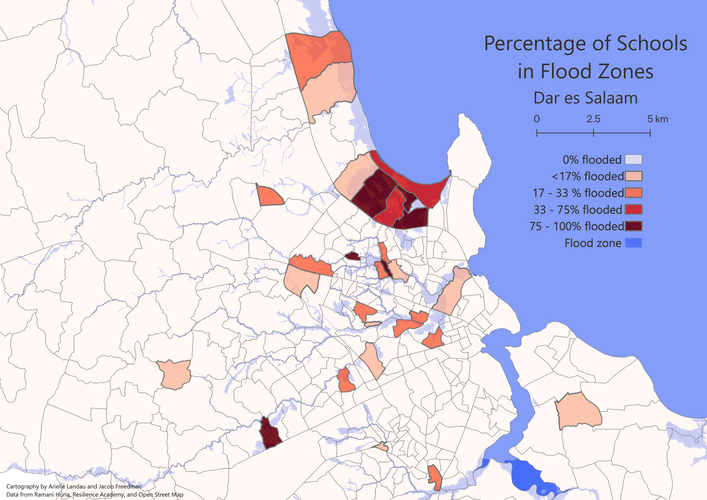

# Analysis of the Resilience of Schools in Subwards of Dar es Salaam

**Guiding Question**

Are schools in Dar Es Salaam vulnerable to flooding? And if so, which subwards are at the most risk of experiencing flooded schools?

A quick study of natural disaster literature and scholarship will tell you that women and children are particularly vulnerable to flooding (Smith 2006). We sought to analyze the vulnerability of children in Dar es Salaam to flooding by examining the number of schools in flood zones. Understanding which schools are at risk of flooding can help improve resilience by informing evacuation policies and plans for resource distribution in the event of a flood.

**Methods**

***A file with all of the sql queries can be found [here](assets/schoolVulnerabilityAnalysis.sql)***

We first extracted the location of schools from Open Street Map, and then found where these schools intersected with flood zones.
```SQL
-- Create school layer
 CREATE TABLE schools AS
 SELECT osm_id, amenity, name, operator, way
 FROM planet_osm_point
 WHERE amenity = 'school';

-- Update schools to add flooded column
ALTER TABLE schools
ADD COLUMN flooded text;

-- updates flooded schools
UPDATE schools
SET flooded = 'yes_flood'
FROM flood
WHERE st_intersects(flood.geom, st_transform(schools.way,32737));

-- Update non-flooded schools
UPDATE schools
SET flooded = 'no_flood'
WHERE flooded IS NULL;
```

We then added subward information to the schools.

```SQL
--  Copy the subwards table for future analyses
CREATE TABLE subwards2 AS
SELECT *
FROM subwards;

--Add subward to school data for future spatial join to polygons
UPDATE schools
SET subward_name = subward
FROM subwards2
WHERE st_intersects(st_transform(subwards2.geom,32737), st_transform(schools.way,32737));

--Alter subward2 table for joining in school data
ALTER TABLE subwards2
ADD COLUMN school_count float;

ALTER TABLE subwards2
ADD COLUMN flooded_school_count float;
```
Now that we know which subward each school is located in, we can count how many schools are in each subward, and how many of the schools are at risk of flooding.

```SQL
--count how many schools are in each ward
UPDATE subwards2
SET school_count = countschool
FROM
(SELECT subward_name, count(schools) as countschool
from schools
group by schools.subward_name
order by countschool) AS a
WHERE a.subward_name = subwards2.subward;

UPDATE subwards2
SET school_count = 0
WHERE school_count IS NULL;

-- count how many flooded schools in each ward:
UPDATE subwards2
SET flooded_school_count = countfloodschool
FROM
(SELECT subward_name, count(schools) as countfloodschool
from schools
where flooded = 'yes_flood'
group by schools.subward_name
order by countfloodschool) AS a
WHERE a.subward_name = subwards2.subward;

UPDATE subwards2
SET flooded_school_count = 0
WHERE flooded_school_count IS NULL;
```
**Results**

You can find our leaflet map [here](https://jafreedman12.github.io/daressalaam/assets/?fbclid=IwAR38WmeqAvszZzetI_BXBAD75dSAWK_cHGY6FLEJuLnqqyXWAyvMytWEI_8#12/-6.7562/39.2710)!

Visualized in the subwards2 layer in the leaflet map are the percentage of schools in each subward that are at risk of flooding. We found several subwards with multiple schools at risk of flooding along the shoreline, such as both the Mbezi Beach subwards and the Bonde la Mpunga subward. Schools in subwards further inland along the historic flood zone were also at risk in subwards such as Uwanja wa Ndege and Mbuyuni. This analysis shows that evacuation plans for future floods need to take into account not only schools along the shoreline, but also schools along the historic flood zone.
Efforts should prioritize the TPDC subward where 6 out of the 7 schools are at risk of flooding.

Visualized in the schools layer in the leaflet map are the location of schools, colored based on their risk of flooding. In the TPDC subward, the schools at risk for flooding are located throughout the subward, meaning a more comprehensive risk management strategy is required. In the Bonde la Mpunga subward, however, the schools at risk of flooding are more concentrated spatially, requiring a less complex risk management strategy as efforts in evacuating schools is limited to one area.



**Sources**
- [Open Street Map](https://www.openstreetmap.org/#map=12/-6.8162/39.2203)
- [Ramana Huria](https://ramanihuria.org/en/): a community mapping project for Dar es Salaam, Tanzania
- [Resilience Academy](https://resilienceacademy.ac.tz/): part of the Ramana Huria project, Resilience Academy seeks to involve young people with resilience planning
- Smith, Neil. 2006. There is No Such Thing as a Natural Disaster.
