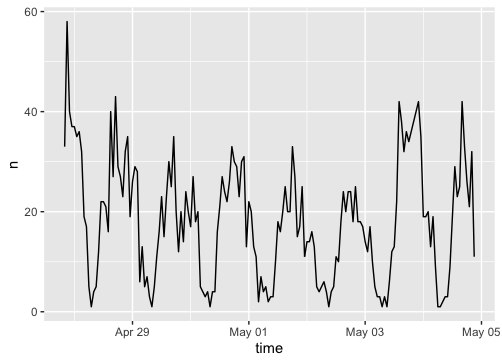
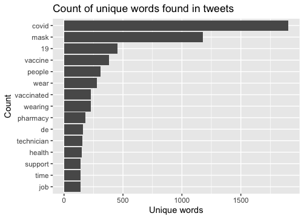
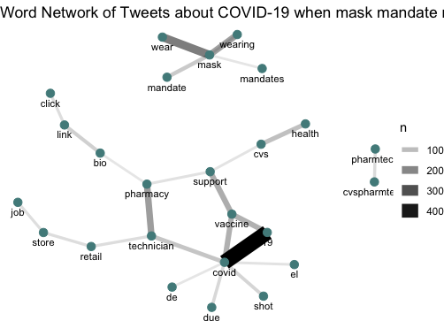
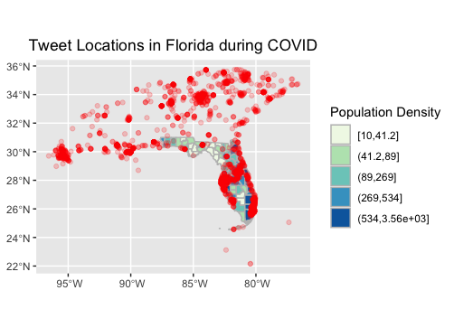
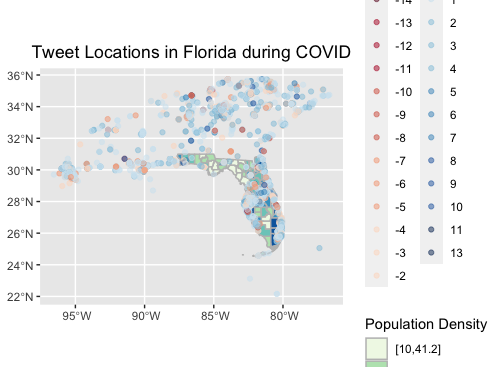

**Replication of**
# Spatial, temporal and content analysis of Twitter data

Original study *by* Wang, Z., X. Ye, and M. H. Tsou. 2016. Spatial, temporal, and content analysis of Twitter for wildfire hazards. *Natural Hazards* 83 (1):523–540. DOI:[10.1007/s11069-016-2329-6](https://doi.org/10.1007/s11069-016-2329-6).
and

First replication study by Holler, J. 2021 (in preparation). Hurricane Dorian vs Sharpie Pen: an empirical test of social amplification of risk on social media.

Replication Author:
Jacob Freedman, looking at twitter data in Florida with the revocation of all statewide COVID restrictions on May 3rd, 2020

Replication Materials Available at: [github repository name](github repository link)

Created: `6 May 2021`
Revised: `20 May 2021`

## Abstract: Why study the spatial distribution of Twitter data?

Wang et al (2016) analyzed Twitter data for wildfires in California, finding that the social media data can show prevalence of conversations about risk and hotspots of disaster in real-time. There is an emphasis on data being shared by centralized sources, showing that even in eras of disinformation, centralized organizations that are "trusted" (such as a local media outlet) are retweeted with high frequency.Holler (2021) is studying Twitter data for Hurricane Dorian on the Atlantic coast, finding that in spite of tending news and social media content regarding a false narrative of risk, original Tweets still clustered significantly along the real hurricane track, and only along the hurricane track.

Reproducing and replicating spatial research of twitter data around vulnerability continues to be relevant because there are always new disasters occurring that communities will tweet about with differing frequencies. In his replication study, I look at the spatial prevalence of tweets about COVID-19 in Florida in the week prior to May 3rd, 2021, when Governor Ron DeSantis removed all statewide COVID restrictions. Expanding upon the given code, I conduct a text sentiment analysis of positive and negative tweets about the mask mandate removal, hoping to visualize hotspots of pushback against and support for the governor's orders.

## Original Study Information

Holler (2021) loosely replicated the methods of Wang et al (2016) for the case of Hurricane Dorian's landfall on the U.S. mainland during the 2019 Atlantic Hurricane season. Holler modified Wang et al's methods by not searching for retweets for network analysis, focusing instead on original Tweet content with keywords hurricane, Dorian, or sharpiegate (a trending hashtag referring to the storm). Holler modified the methodology for normalizing tweet data by creating a normalized Tweet difference index and extended the methodology to test for spatial cluserting with the local Getis-Ord statistic. The study tested a hypothesis that false narratives of hurricane risk promulgated at the highest levels of the United States government would significantly distort the geographic distribution of Twitter activity related to the hurricane and its impacts, finding that original Twitter data still clustered only in the affected areas of the Atlantic coast in spite of false narratives about risk of a westward track through Alabama. The replication study by Holler (2021) used R, including the rtweet, rehydratoR, igraph, sf, and spdep packages for analysis. (Written by Joseph Holler)

Wang et al (2016) conducted their study using the `tm` and `igraph` packages in `R 3.1.2`. Is it known what GIS software was used for spatial analysis?

## Materials and Procedure

Using the search parameters of "COVID", "mask", and "restriction" at a 500mi radius of the centroid of Florida (28.56,-82.63), I was able to download an initial set of 89695 tweets. In comparison, the total of number of tweets in the region at the time was 215997 tweets. When reduced down to tweets with associated (and usable) spatial data, the number of tweets about COVID, masks, and restrictions is 3111, and for the Florida baseline is 10280. These data can be rehydrated with filtered Tweet IDs by using the associated links for [florida_covid](add link) and [florida_baseline](add link to data/derived/public). The tweets were analyzed in the same way as done by Wang et al. (2016) and Holler (2021), with some modifications towards sentiment analysis in different locations.

## Replication Results

Figure 1: Temporal analysis of tweets related to "COVID", "mask", or "restriction" in Florida

Figure 2: Content analysis graph of tweets about "COVID", mask", or "restriction" in Florida

Figure 3: Word network twitter activity of tweets about "COVID", mask", or "restriction" in Florida

Figure 4: Tweet location about "COVID", mask", or "restriction" in Florida

Figure 5: Sentiment analysis of tweets of tweets about "COVID", mask", or "restriction" across Florida

## Unplanned Deviations from the Protocol

My primary deviations from the protocol centered around trying to create a text sentiment analysis of tweets across Florida (Fig. 5). While I did not construct a heatmap of tweets in Florida (as they appear to stem from cities) nor a heatmap of positive/negative sentiment (as you can see more nuance in the point output), one can get perhaps a greater understanding of how tweets overlap in a given space.

## Discussion

These findings suggest that patterns of Tweets around COVID in Florida are not as simple as pro- or against- mask mandates, as a streamlined sentiment analysis cannot be constructed from such a genaralized search function. Since sentiment analysis inherently simplifies text and many of these tweets are about COVID and not the mask mandate itself, it is challenging to determine the overall sentiment in a given place. Rather, this analysis shows the overlapping nature of people's sentiments in regards to COVID, masks, and mask restrictions, as there is not one agreed upon view of how COVID should be managed in any given place. This can be best seen in the reopening of schools, where there is not one clear political position for progressives on this issue.

Nevertheless, at this point in the pandemic, this analysis suggests that there appears to be less specific resistance to Governor DeSantis' removal of the statewide mask mandate. With no major increase in tweets during this time frame, it does not appear that the Governor's decision caused a spike in resistance.Furthermore, the United States at-large has relaxed its mask mandates in the three weeks between the time of download (late April/early May) and the conclusion of this analysis (20 May 2021).

Seeing as the COVID-19 pandemic is not a specific, time-bound catastrophe such as a wildfire or  hurricane, but has been an ongoing disaster for the last year and a half, it is challenging to compare the efficacy of this analysis alongside those conducted by Wang et al. (2016) or Holler (2021). Regardless, this expansion of analysis onto COVID twitter data in Florida shows that this data processing format (open-source analysis of privately-downloaded Twitter data) is replicable and potentially usable for future natural disasters across various landscapes.

## Conclusion

This analysis helps show how using Twitter data for understanding vulnerability can be best applied to certain time-bounded disaster events. With an ongoing disaster such as the COVID-19 pandemic, certain issues that may have gotten more uptake by the media earlier on in the pandemic (removal of mask mandate in Florida) have become commonplace and receive less attention than before. This strategy of sentiment analysis can be applied to further research of understanding diverging perceptions about public issues (elections, for example).

Future research could expand this analysis into languages other than English, as during this same time frame there was a notable [earthquake in Mexico](cite this) and an ongoing [surge in COVID cases in India](https://www.nature.com/articles/d41586-021-01059-y). Each of these languages have different letters and syntax than English, possibly complicating a English Twitter analysis that has fewer accents that other languages.

## References

- Wang, Z., X. Ye, and M. H. Tsou. 2016. Spatial, temporal, and content analysis of Twitter for wildfire hazards. *Natural Hazards* 83 (1):523–540. DOI:[10.1007/s11069-016-2329-6](https://doi.org/10.1007/s11069-016-2329-6).

####  Report Template References & License

This template was developed by Peter Kedron and Joseph Holler with funding support from HEGS-2049837. This template is an adaptation of the ReScience Article Template Developed by N.P Rougier, released under a GPL version 3 license and available here: https://github.com/ReScience/template. Copyright © Nicolas Rougier and coauthors. It also draws inspiration from the pre-registration protocol of the Open Science Framework and the replication studies of Camerer et al. (2016, 2018). See https://osf.io/pfdyw/ and https://osf.io/bzm54/

Camerer, C. F., A. Dreber, E. Forsell, T.-H. Ho, J. Huber, M. Johannesson, M. Kirchler, J. Almenberg, A. Altmejd, T. Chan, E. Heikensten, F. Holzmeister, T. Imai, S. Isaksson, G. Nave, T. Pfeiffer, M. Razen, and H. Wu. 2016. Evaluating replicability of laboratory experiments in economics. Science 351 (6280):1433–1436. https://www.sciencemag.org/lookup/doi/10.1126/science.aaf0918.

Camerer, C. F., A. Dreber, F. Holzmeister, T.-H. Ho, J. Huber, M. Johannesson, M. Kirchler, G. Nave, B. A. Nosek, T. Pfeiffer, A. Altmejd, N. Buttrick, T. Chan, Y. Chen, E. Forsell, A. Gampa, E. Heikensten, L. Hummer, T. Imai, S. Isaksson, D. Manfredi, J. Rose, E.-J. Wagenmakers, and H. Wu. 2018. Evaluating the replicability of social science experiments in Nature and Science between 2010 and 2015. Nature Human Behaviour 2 (9):637–644. http://www.nature.com/articles/s41562-018-0399-z.
